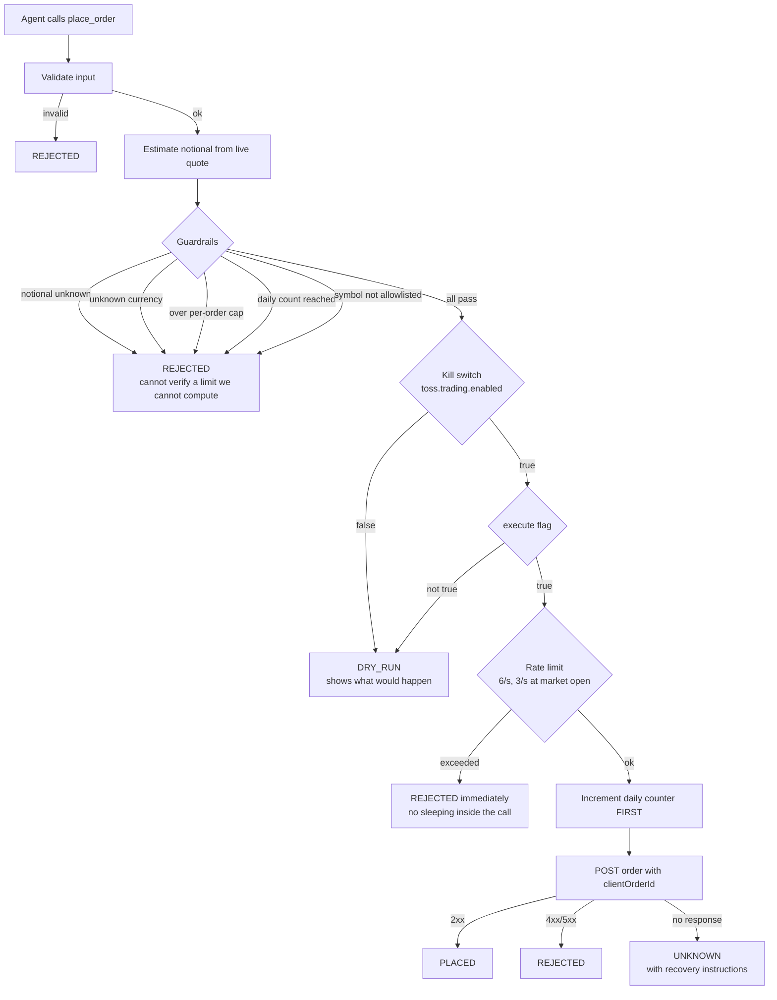
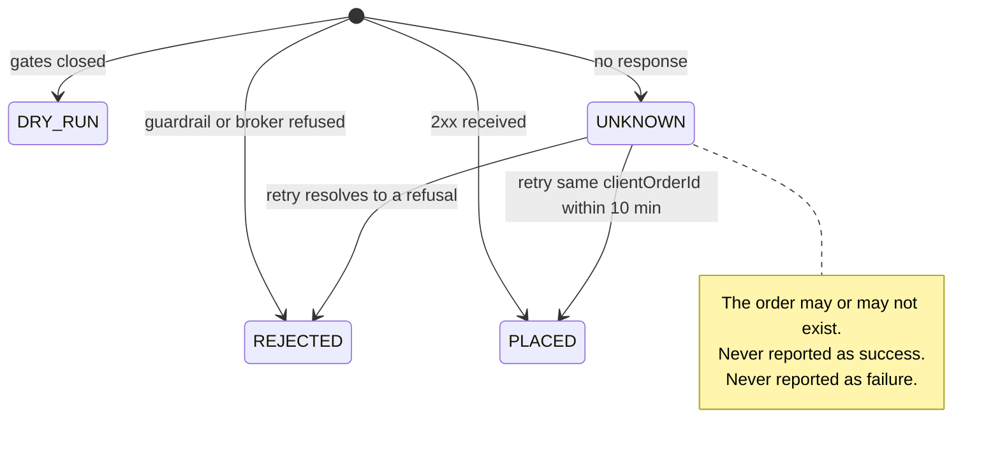

# Where the agent is allowed to act — and where it is stopped

This document is about one question: **when an AI agent can move real money, what is it allowed to do, and what happens when the answer never comes back?**

Most "AI + API" integrations answer the first half and skip the second. This server answers both, and every decision below is enforced in code and pinned by a test.

> **Context that shapes everything here:** Toss Securities provides **no sandbox and no paper-trading environment**. There is no safe place to rehearse. The first time an order path runs for real, it runs against a real account with real money. That single fact is why the defaults below are closed rather than open.

---

## The shape of the problem

An agent calling a read-only API is a search problem. An agent calling a **write** API is a different problem, because three things stop being true:

1. **Retrying is no longer free.** A retried search returns the same page. A retried order buys the stock twice.
2. **"No response" is not "no effect."** A timeout tells you the network failed. It does not tell you whether the order reached the broker.
3. **The caller cannot see what you saw.** The agent decides, but a human owns the account. If the agent's reasoning is invisible, the human cannot audit it.

Everything below follows from those three.

---

## The path an order takes



**Read the order of the diamonds.** Guardrails are evaluated **before** the kill switch, not after. That ordering is deliberate and it is the first design decision worth explaining.

---

## Six decisions

### 1. Guardrails run before the kill switch, so a preview tells the truth

The obvious implementation checks the kill switch first: if trading is off, return a preview and skip the rest. It is cheaper and it is wrong.

If the kill switch short-circuits, an order that violates your limits still renders as *"here is what would happen."* The user sees a clean preview, flips trading on, and **only then** discovers the order was never allowed. The preview lied by omission.

So limits are evaluated first. A rejected order reads as `REJECTED` **in dry-run mode too**.

```
evaluatePlace:  guardrails  →  kill switch  →  execute flag
```

### 2. If the amount cannot be computed, the order is refused

The per-order cap needs an estimated notional, which needs a live quote. When the quote lookup fails, the notional is `null`.

A `null` here is not "no limit." It is "the limit is unverifiable." The guard returns `REJECT`:

> *"The order amount could not be computed (quote lookup failed), so the limit cannot be verified."*

The same rule covers an unrecognised currency. **Not knowing is a reason to stop, not a reason to continue.**

### 3. The counter increments *before* the request, not after

```java
// Count conservatively: if we sent it, we counted it
// (it may have been accepted even if we never saw the response).
counter.increment();
try {
    String raw = api.placeOrder(body);
    ...
```

Counting after a successful response is the intuitive version and it undercounts exactly when it matters. A request that times out may still have been accepted by the broker. If it is not counted, the daily cap silently drifts upward every time the network misbehaves — the cap erodes under precisely the conditions that make you want a cap.

Counting first can overcount. Overcounting stops you early. Undercounting lets you through. **The failure modes are not symmetric, so the default is not symmetric either.**

### 4. `UNKNOWN` is a real status, not an error

Most clients collapse a network failure into failure. That is a lie when the write may have landed.



`UNKNOWN` carries the recovery path in the message itself — check open orders, **or retry with the same `clientOrderId` within 10 minutes and receive the same outcome without placing a second order.**

That is what the idempotency key is for. Every order is sent with a `clientOrderId`, generated per call, and returned to the caller **even when the call fails** — because a key you cannot see is a key you cannot retry with.

### 5. The write path never touches the cache or request coalescing

The read path does aggressive caching and coalesces concurrent identical requests into one upstream call. Applying that to orders would be catastrophic: **two different orders merged into one is a lost trade, and two identical orders merged is a silently dropped one.**

Account state is also left uncached, for a subtler reason:

> *If the order you just placed is not visible yet, the brain places it again.*

A stale portfolio read does not merely show old data — it actively causes duplicate orders, because the agent reasons from what it can see.

### 6. Rate limiting rejects; it does not wait

Toss allows 6 order requests per second, dropping to 3 during the opening rush (09:00–09:10 KST). When the limit is hit, the natural move is to sleep and retry.

This server refuses instead. **Sleeping inside a tool call blocks the caller with no explanation** — the agent sees a hung tool, not a rate limit, and cannot reason about it or tell the user. An immediate rejection is information; a stalled call is not.

---

## What is deliberately *not* implemented

A safety document that only lists what was added is incomplete. This is what was left out on purpose.

**`confirmHighValueOrder` is never set.**

```java
// Deliberately omitted. Toss blocks orders above 100M KRW behind this flag.
// If we set it automatically, that protection disappears.
```

The broker has its own protection for very large orders. Automating past it would trade a real safety net for convenience. The flag exists in the API; this server does not use it.

**No strategy lives in the server.** It does not decide what to buy or when. Validation, limits, transport, and honest reporting are the whole job. The decision belongs to whatever is driving the tools — and keeping the two apart means the guardrails cannot be argued out of by a clever prompt.

**No hidden retries.** Nothing in the write path retries on its own. A retry is a decision with money attached, so it is surfaced to the caller with the key needed to make it safely.

---

## Defaults are closed

```java
/**
 * Live-trading safety settings. Defaults are "off and tight" —
 * the user has to open them on purpose.
 * When enabled is false, no request is ever actually transmitted.
 */
```

| Setting | Default | Effect |
|---|---|---|
| `toss.trading.enabled` | `false` | Nothing is transmitted. Every call previews. |
| `toss.trading.max-order-notional-krw` | `100,000` KRW | Per-order ceiling |
| `toss.trading.max-order-notional-usd` | `100` USD | Per-order ceiling |
| `toss.trading.daily-order-count` | `20` | Per-day ceiling, resets at KST midnight |
| `toss.trading.symbol-allowlist` | empty | Empty means unrestricted — the one default that is *open*, and it is called out here for that reason |

Two switches must both be open for an order to leave the process: the **server-level kill switch** and a **per-call `execute` flag**. One is configuration the operator sets; the other is an explicit intent on that specific call. Neither alone is enough.

---

## Cancellation is exempt from the amount and count limits

```java
/**
 * Cancels are not subject to the notional/count guardrails. Blocking a cancel
 * by limit would trap you in a position you want out of — which is worse.
 */
```

A guardrail that prevents you from *reducing* exposure is not a guardrail. Cancels still respect the kill switch and the `execute` flag, but never the caps. **Safety limits should constrain how much you can get in, never how fast you can get out.**

---

## How this is verified

None of the guard logic depends on the network or the wall clock — `Clock` is injected — so all of it is exhaustively testable without touching the live API.

```
./gradlew test --tests '*OrderGuardTest' --tests '*DailyOrderCounterTest' \
               --tests '*OrderRateLimiterTest' --tests '*TradingServiceTest'

OrderGuardTest          14 tests
OrderRateLimiterTest     6 tests
DailyOrderCounterTest    3 tests
TradingServiceTest      27 tests
                        ─────────
                        50 tests, 0 failures
```

Each decision above maps to a named test. The test names are listed literally, so you can check the claim against the file rather than take this table's word for it.

| Decision | Test |
|---|---|
| **1** — guardrails run before the kill switch | `OrderGuardTest.notionalOverCapIsRejectedEvenWhileTradingDisabled` |
| **2** — unverifiable amount is refused | `OrderGuardTest.unknownNotionalIsRejected`<br/>`OrderGuardTest.unknownCurrencyIsRejectedRatherThanDefaultingToKrwCap`<br/>`TradingServiceTest.marketOrderIsRejectedWhenPriceLookupFails` |
| **3** — count before sending | `TradingServiceTest.placeOrderIncrementsDailyCounterEvenOnTimeout` |
| **4** — `UNKNOWN`, and no silent retry | `TradingServiceTest.timeoutReturnsUnknownAndDoesNotRetry` |
| **4** — idempotency key sent, high-value confirm not | `TradingServiceTest.enabledWithExecuteSendsIdempotencyKeyAndNoHighValueConfirm` |
| **5** — account state is never cached | `TradingServiceTest.accountStateReadsAreNotCached` |
| **6** — reject rather than wait | `TradingServiceTest.placeOrderRejectedWhenRateLimiterDenies` |
| **6** — 6/s, and 3/s from 09:00 to 09:10 | `OrderRateLimiterTest.allowsSixPerSecondOutsideTheOpeningRush`<br/>`…allowsOnlyThreePerSecondDuringTheOpeningRush`<br/>`…rushWindowStartsAtNineSharp` · `…rushWindowEndsAtNineTen` |
| Defaults closed — nothing transmits when off | `TradingServiceTest.disabledTradingNeverSendsTheOrder` |
| Caps: KRW, USD, per-day, allowlist | `OrderGuardTest.usdCapAppliesToUsdOrders`<br/>`…notionalExactlyAtCapIsNotRejected` · `…dailyOrderCountAtLimitIsRejected`<br/>`…symbolOutsideAllowlistIsRejected` · `TradingServiceTest.usTickerOverUsdCapIsRejectedAndNeverSent` |
| Daily cap rolls over at KST midnight, not UTC | `DailyOrderCounterTest.resetsAtKoreanMidnight`<br/>`DailyOrderCounterTest.doesNotResetAtUtcMidnight` |
| Cancels exempt from caps, still gated | `OrderGuardTest.cancelIsNotSubjectToNotionalOrCountGuardrails`<br/>`OrderGuardTest.cancelStillRespectsKillSwitch` |
| Broker errors surface readably without leaking internals | `TradingServiceTest.placeOrderMapsTossRejectionToHumanReadableReasonWithoutLeakingRawException` |

`DailyOrderCounter` and `OrderRateLimiter` use `ReentrantLock` rather than `synchronized` so they do not pin virtual threads. `VirtualThreadPinningTest` enforces that property on the **cache hot path and token refresh** — the order-path locks follow the same rule by construction, but are not themselves covered by that test.

---

## Honest limits

- **No sandbox exists.** Toss Securities offers no paper-trading environment, so the kill switch is the only rehearsal mechanism. Dry-run mode exercises validation, estimation, and the guards — it does not exercise the broker.
- **The notional is an estimate.** It is derived from a live quote, so a market order can fill at a different price than the one checked against the cap.
- **The daily counter is in-process.** It resets when the process restarts. It is a guardrail, not an audit ledger.
- **Overcounting is possible by design** (decision 3). A request that failed to send may still consume a slot.

Each of these is a real limit, stated here rather than discovered later.

---

## The one-line version

**Deciding what an agent may do is the easy half. The hard half is deciding what it does when it cannot tell whether it already did it.**
